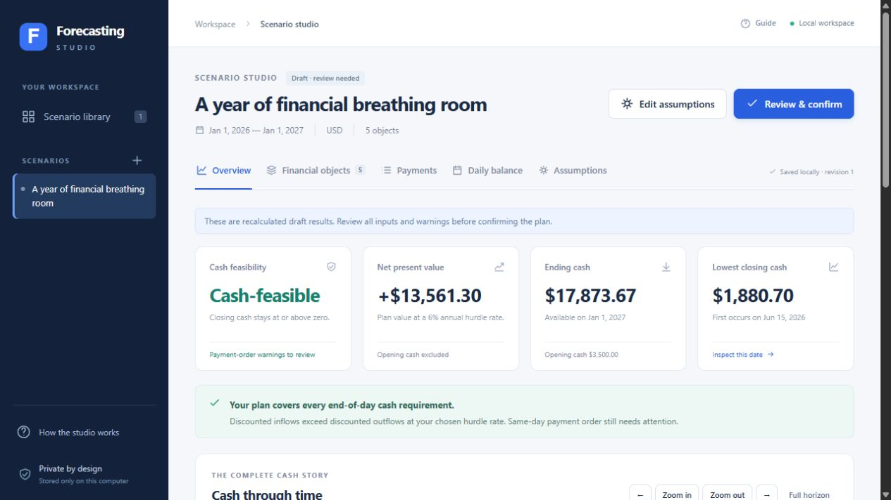
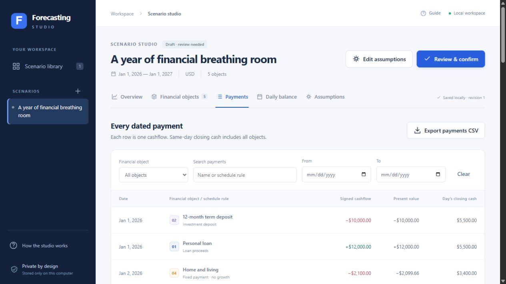
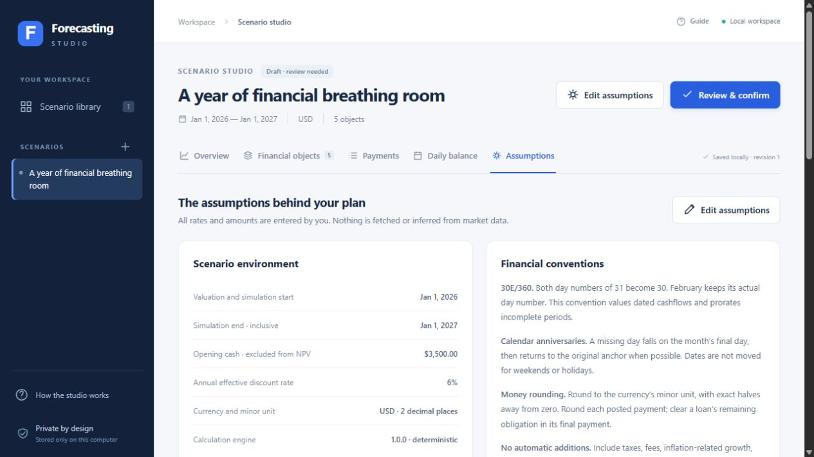
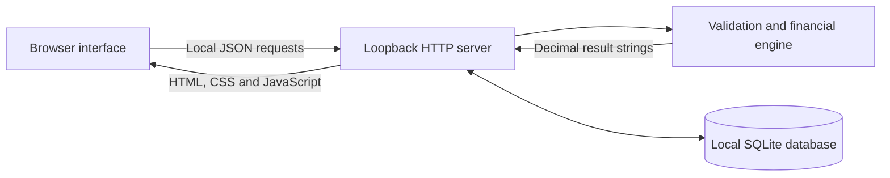

# Financial Forecasting Studio

**A privacy-first financial scenario modeller for answering two different questions: can a plan meet every daily cash requirement, and what is the plan worth in present-value terms?**



Financial Forecasting Studio combines loans, investments, recurring income, recurring expenses, and irregular cashflows in one dated model. It runs entirely on the user's computer with Python's standard library, a local SQLite database, and a browser interface.

No account, API key, cloud service, package installation, telemetry, or internet connection is required at runtime.

## Why this project exists

A financially attractive plan can still fail because cash arrives too late. Conversely, enough opening cash can prevent a shortfall without making the underlying arrangement economically valuable.

This application deliberately keeps those questions separate:

- **Cash feasibility** calculates the closing cash balance for every calendar day and identifies the first shortfall and lowest balance.
- **Net present value** discounts modeled cashflows to the scenario start while excluding opening cash, which is an existing liquidity resource rather than value created by the plan.

## Product highlights

- Model loans from either a known principal or known repayment.
- Model maturity-compounding or periodically paying investments.
- Add recurring income and expenses with annual or per-payment growth.
- Enter signed, individually dated custom cashflows.
- Inspect daily balances, payment schedules, loan principal and interest, and present-value contributions.
- Compare independent scenario copies without overwriting the original.
- Detect dates where settlement order can temporarily determine feasibility.
- Export payment and balance reports as CSV.
- Export and restore editable scenario backups as versioned JSON.
- Work offline with data stored only in a local SQLite database.

<p align="center">
  
  
</p>

## Engineering highlights

| Area | Implementation |
| --- | --- |
| Monetary correctness | `Decimal` arithmetic with a 60-digit calculation context and currency-aware `ROUND_HALF_UP` posting |
| Scheduling | Calendar-anchored monthly, quarterly, and yearly schedules with explicit stub-period treatment |
| Valuation | 30E/360 discounted cashflows, with NPV rounded once after summation |
| Persistence | SQLite transactions, optimistic revision checks, and atomic multi-scenario imports |
| Privacy | Loopback-only HTTP server, no telemetry, no external assets, and local data excluded from Git |
| Web security | Host and origin checks, restrictive content-security policy, request limits, no-cache private responses, and CSV formula neutralization |
| Verification | 87 financial, calendar, storage, HTTP, restart, backup, and security tests using independent calculation oracles |
| Accessibility | Keyboard navigation, visible focus, semantic controls, live status/error regions, responsive layouts, and a skip link |

## Technology

- **Backend:** Python 3.11+, `http.server`, `sqlite3`, and `decimal`
- **Frontend:** semantic HTML, modern CSS, vanilla JavaScript, and inline SVG icons/charts
- **Data:** local SQLite plus JSON backup and CSV reporting formats
- **Testing:** Python `unittest`; no test framework dependency
- **Runtime dependencies:** none outside the Python standard library and a current browser

## Architecture



The browser owns interaction and presentation. It does not calculate monetary results. The Python engine validates inputs, generates schedules, posts rounded cashflows, evaluates daily liquidity, and discounts cashflows. See [Architecture](docs/ARCHITECTURE.md) for component boundaries and data flow.

## Quick start

### Requirements

- Python 3.11 or newer
- A current browser

### Windows

Double-click `Start Studio.cmd`, then open the local address printed in the window.

### Windows, macOS, or Linux terminal

```console
python run.py
```

On systems where Python 3 is named `python3`:

```console
python3 run.py
```

Open <http://127.0.0.1:8765> and keep the terminal running. Stop with `Ctrl+C`.

If port 8765 is already in use:

```console
python run.py --port 8766
```

To see the application without entering data, choose **Explore an example** from the empty library. The example is fictional and is only added after that explicit action.

## Test the project

```console
python -m unittest discover -v
```

The 87-test suite uses temporary databases and does not alter saved scenarios. Continuous integration runs the suite on Windows, macOS, and Linux across the declared Python versions.

For the evidence matrix and browser workflow, read [Verification](docs/VERIFICATION.md).

## Financial model at a glance

- Supported currencies: USD, EUR, GBP, CAD, AUD, CHF, JPY, and KWD.
- Supported schedules: monthly, quarterly, and yearly.
- Rate inputs: nominal annual, effective annual, or per-payment-period.
- Day-count convention: European 30E/360.
- Loan terms: 1–1,200 repayments with a final reconciliation payment.
- Scenario dates: 1900–2199, with a maximum 100-year horizon.
- Capacity: up to 200 objects and 25,000 generated payments per scenario.

Exact formulas, rounding boundaries, partial-period decisions, and worked examples are documented in [Financial Decisions](docs/FINANCIAL_DECISIONS.md).

## Privacy and security

Saved scenarios live in `data/scenarios.sqlite3`. The entire `data/` directory is excluded from Git because scenario names, amounts, and notes may be sensitive. The private repository is intended to contain source code and fictional demonstration material, not the owner's financial records.

The server binds only to `127.0.0.1`. It is private to the computer, but the database is not encrypted and is accessible to people or software with access to the same operating-system account. Exported JSON and CSV files are also unencrypted.

Before sharing the repository, run the privacy checklist in [Private Repository Sharing](docs/PUBLISHING.md). Security assumptions and reporting guidance are in [Security](SECURITY.md).

## Backup and portability

- Use **Export backup** for a restorable, versioned JSON copy of all scenarios.
- Payment and daily-balance CSV files are reports, not editable backups.
- Stop the application before manually copying its `data/` folder so the SQLite database and any companion files are copied together.
- Use `python run.py --data-dir "<folder>"` to store private data somewhere other than the project directory.

## Deliberate limitations

The model does not automatically add taxes, fees, inflation, currency conversion, interest on idle cash, overdrafts, asset liquidation, holiday adjustments, or intraday settlement ordering. These must be modeled explicitly where relevant.

This software is an educational planning tool, not financial advice, accounting software, or a representation of any institution's contract terms. Review assumptions against the actual financial products being modeled.

## Repository guide

```text
run.py                     Application entry point
Start Studio.cmd           Windows launcher
studio/                    Financial engine, storage, and local server
web/                       Browser interface and chart renderer
tests/                     Automated unit and integration tests
docs/                      Architecture, decisions, verification, and project context
qa/import-fixture.json     Fictional backup/import fixture
data/                      Private runtime data; intentionally not tracked
```

Start with these documents:

- [Project Brief](docs/PROJECT_BRIEF.md) — problem, users, goals, and non-goals
- [Architecture](docs/ARCHITECTURE.md) — components, boundaries, APIs, and data flow
- [Financial Decisions](docs/FINANCIAL_DECISIONS.md) — calculation conventions and worked examples
- [Verification](docs/VERIFICATION.md) — tests and browser workflow evidence
- [AI Context](docs/AI_CONTEXT.md) — concise machine-readable project facts and evidence map
- [Contributing](CONTRIBUTING.md) — safe development and review workflow
- [Changelog](CHANGELOG.md) — released capabilities

## Project status

Version **1.0.0** is a complete local application. The current focus is transparent calculation, private single-user workflows, and reproducible verification rather than cloud deployment or live market integrations.

This repository is intentionally private and has no open-source license. Access is limited to people invited by its owner.
