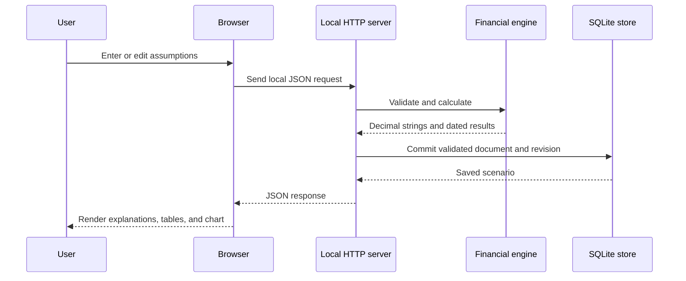

# Architecture

## Overview

Financial Forecasting Studio is a local three-layer application:

1. A browser interface renders forms, tables, charts, and explanations.
2. A loopback-only Python server exposes a small JSON API and serves static assets.
3. A deterministic financial engine and SQLite store own calculation and persistence.

There is no cloud backend, build service, package-registry dependency, or client-side financial calculation.

## Data flow

## Components

### `studio/finance.py`

The pure calculation boundary. It validates scenario assumptions, derives periodic rates, generates schedules, posts currency-rounded cashflows, creates the daily cash ledger, detects shortfalls and payment-order warnings, and calculates NPV.

It does not access the database, clock, filesystem, network, or browser. Monetary values cross its JSON boundary as decimal strings.

### `studio/dates.py`

Contains calendar-anchor scheduling and European 30E/360 day-count functions. Month-end schedules return to their original day when later months allow it, rather than drifting permanently after February.

### `studio/storage.py`

Stores scenario assumptions as JSON documents in SQLite. Transactions provide atomic saves and imports. Revisions provide optimistic concurrency control, so a stale browser window cannot silently overwrite a newer edit.

Calculated schedules are not cached in the database. They are reproduced from saved assumptions when a scenario is opened.

### `studio/server.py`

Serves the frontend and maps HTTP requests to calculation and persistence operations. The server binds to `127.0.0.1` and validates host and origin information before allowing changes.

### `web/app.js`

Owns application state, navigation, forms, validation messages, local API calls, reports, and accessible interaction wiring. It formats calculation strings for display but does not calculate money.

### `web/chart.js`

Converts already-calculated values to JavaScript numbers only for SVG coordinates. The chart cannot change financial results.

## API surface

| Method and route | Purpose |
| --- | --- |
| `GET /api/health` | Report readiness and engine version |
| `GET/POST /api/scenarios` | List or create scenarios |
| `GET/PUT/DELETE /api/scenarios/{id}` | Read, save, or delete one scenario |
| `POST /api/calculate` | Validate and calculate unsaved assumptions |
| `POST /api/scenarios/{id}/duplicate` | Create an independent scenario copy |
| `POST /api/scenarios/{id}/confirm` | Confirm a reviewed saved revision |
| `GET /api/scenarios/{id}/payments.csv` | Export payment schedules |
| `GET /api/scenarios/{id}/balance.csv` | Export the daily cash ledger |
| `GET /api/backup` | Export all scenarios as versioned JSON |
| `POST /api/import` | Atomically import compatible scenarios |

The API is an internal loopback interface, not a public or authenticated web API.

## Persistence model

Each database row contains a generated identifier, entered scenario document, integer revision, confirmation state, warning-acceptance state, and UTC update timestamp.

The default database path is `data/scenarios.sqlite3`. The runtime creates the directory and schema when needed. The `--data-dir` option supports a private location outside the repository.

## Trust boundaries

- All browser input is untrusted and validated by the Python backend.
- Scenario documents and imports have type, length, count, date, and numerical limits.
- Mutation requests require a local request header and an allowed origin.
- Host validation reduces DNS-rebinding exposure.
- Responses use a restrictive content-security policy and are not cached.
- Downloaded text fields are neutralized when they could be interpreted as spreadsheet formulas.
- Database contents and exported files are unencrypted private data.

## Change guide

| Change | Primary files | Verification expectation |
| --- | --- | --- |
| Financial convention | `studio/finance.py`, `docs/FINANCIAL_DECISIONS.md` | Independent numerical examples and regression tests |
| Calendar behavior | `studio/dates.py` | Explicit month-end, leap-year, and anchor tests |
| Stored document shape | `studio/storage.py` | Migration, compatibility, and restart tests |
| HTTP behavior | `studio/server.py` | Integration, validation, and security tests |
| Interface behavior | `web/app.js`, `web/styles.css` | Browser workflow and responsive inspection |
| Chart interaction | `web/chart.js` | Keyboard, tooltip, and result-invariance checks |

## Scaling boundary

The architecture intentionally favors inspectability and local use over distributed scale. `ThreadingHTTPServer` and a single SQLite database are appropriate for one user on one computer; they are not intended for internet deployment or multi-tenant workloads.
